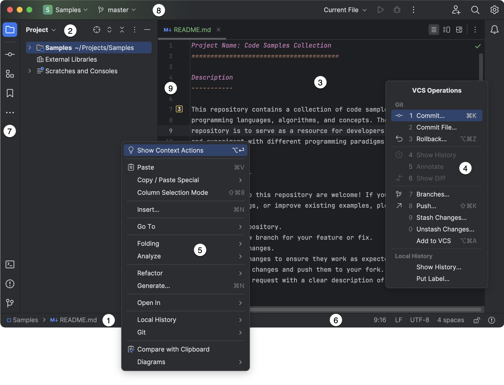
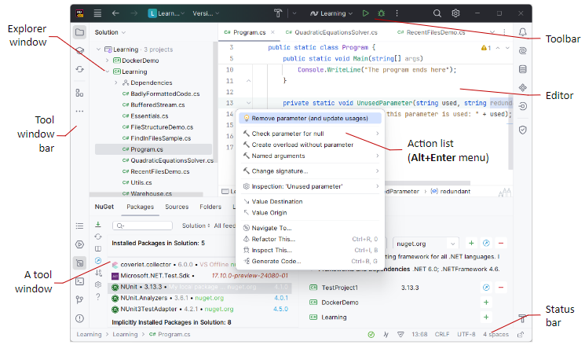

# Entornos de Desarrollo - 02 Entornos de desarrollo
Tema 02. Entornos de desarrollo. Curso 2025-2026.

- [Entornos de Desarrollo - 02 Entornos de desarrollo](#entornos-de-desarrollo---02-entornos-de-desarrollo)
- [Contenido en Youtube](#contenido-en-youtube)
  - [1. Introducción a los Entornos de Desarrollo Integrados (IDE)](#1-introducción-a-los-entornos-de-desarrollo-integrados-ide)
    - [1.1. Concepto y rol del IDE en la codificación](#11-concepto-y-rol-del-ide-en-la-codificación)
    - [1.2. Componentes esenciales del IDE y su función](#12-componentes-esenciales-del-ide-y-su-función)
      - [1.2.1. Editor de código fuente (Resaltado, autocompletado, analizadores)](#121-editor-de-código-fuente-resaltado-autocompletado-analizadores)
      - [1.2.2. Compilador/Intérprete (Traducción a código máquina)](#122-compiladorintérprete-traducción-a-código-máquina)
      - [1.2.3. Depurador (Debugger) (Puntos de ruptura, examen de variables)](#123-depurador-debugger-puntos-de-ruptura-examen-de-variables)
      - [1.2.4. Gestión de proyectos o ficheros (Explorador de archivos o Soluciones)](#124-gestión-de-proyectos-o-ficheros-explorador-de-archivos-o-soluciones)
      - [1.2.5. Terminal integrado](#125-terminal-integrado)
      - [1.2.6. Control de Versiones](#126-control-de-versiones)
      - [1.2.7. Herramientas de Refactorización (Mejora de Código)](#127-herramientas-de-refactorización-mejora-de-código)
      - [1.2.8. Plugins y Complementos (Modularidad)](#128-plugins-y-complementos-modularidad)
  - [2. Instalación de Herramientas Fundamentales para el Curso](#2-instalación-de-herramientas-fundamentales-para-el-curso)
    - [2.1. Kits de Desarrollo](#21-kits-de-desarrollo)
      - [2.1.1. Instalación de JDK 21 (Java Development Kit)](#211-instalación-de-jdk-21-java-development-kit)
      - [2.1.2. Instalación de .NET 8 (SDK/Runtime)](#212-instalación-de-net-8-sdkruntime)
    - [2.2. Instalación de Entornos Integrados de Desarrollo (IDE)](#22-instalación-de-entornos-integrados-de-desarrollo-ide)
      - [2.2.1. Instalación de IntelliJ IDEA (JetBrains)](#221-instalación-de-intellij-idea-jetbrains)
      - [2.2.2. Instalación de JetBrains Rider (JetBrains)](#222-instalación-de-jetbrains-rider-jetbrains)
      - [2.2.3. Instalación de Visual Studio Code (VS Code)](#223-instalación-de-visual-studio-code-vs-code)
    - [2.3. Instalación de Herramientas de Control de Versiones](#23-instalación-de-herramientas-de-control-de-versiones)
      - [2.3.1. Instalación de Git](#231-instalación-de-git)
      - [2.3.2. Instalación de GitKraken](#232-instalación-de-gitkraken)
    - [2.4. Instalación de fuentes adicionales](#24-instalación-de-fuentes-adicionales)
    - [2.5. Instalación de terminal Oh My Posh (Desarrollador)](#25-instalación-de-terminal-oh-my-posh-desarrollador)
  - [3. Anatomía y Estructura de los IDEs Seleccionados](#3-anatomía-y-estructura-de-los-ides-seleccionados)
    - [3.1. Filosofía JetBrains: Uniformidad de Flujo de Trabajo](#31-filosofía-jetbrains-uniformidad-de-flujo-de-trabajo)
      - [3.1.1. Consistencia de la Interfaz (IntelliJ IDEA y Rider)](#311-consistencia-de-la-interfaz-intellij-idea-y-rider)
      - [3.1.2. Uso de la Terminal integrada](#312-uso-de-la-terminal-integrada)
    - [3.2. Estructura de IntelliJ IDEA y JetBrains Rider](#32-estructura-de-intellij-idea-y-jetbrains-rider)
    - [3.3. Estructura de Visual Studio Code (VS Code)](#33-estructura-de-visual-studio-code-vs-code)
  - [4. Plugins, Configuración y Personalización del Entorno](#4-plugins-configuración-y-personalización-del-entorno)
    - [4.1. Gestión de Plugins y Extensiones (Modularidad)](#41-gestión-de-plugins-y-extensiones-modularidad)
      - [4.1.1. Gestión en IntelliJ IDEA y JetBrains Rider (JetBrains)](#411-gestión-en-intellij-idea-y-jetbrains-rider-jetbrains)
      - [4.1.2. Gestión en Visual Studio Code (VS Code)](#412-gestión-en-visual-studio-code-vs-code)
    - [4.2. Personalización Visual y de Uso](#42-personalización-visual-y-de-uso)
      - [4.2.1. Acceso a la Configuración General](#421-acceso-a-la-configuración-general)
      - [4.2.2. Temas, Apariencia y Configuración de Archivos](#422-temas-apariencia-y-configuración-de-archivos)
      - [4.2.3. Configuraciones Específicas del Proyecto (VS Code)](#423-configuraciones-específicas-del-proyecto-vs-code)
      - [4.2.4. Refactorización (Mejora de Código)](#424-refactorización-mejora-de-código)
    - [4.3. Actualización y Mantenimiento del Entorno](#43-actualización-y-mantenimiento-del-entorno)
  - [5. Operativa Básica del IDE](#5-operativa-básica-del-ide)
    - [5.1. Edición Asistida y Refactorización](#51-edición-asistida-y-refactorización)
      - [5.1.1. Edición Asistida (IntelliSense y Sugerencias)](#511-edición-asistida-intellisense-y-sugerencias)
      - [5.1.2. Funciones Avanzadas de Edición (VS Code)](#512-funciones-avanzadas-de-edición-vs-code)
      - [5.1.3. Refactorización (Operativa JetBrains)](#513-refactorización-operativa-jetbrains)
    - [5.2. Generación de Ejecutables (Build)](#52-generación-de-ejecutables-build)
    - [5.3. Depuración (Debugging)](#53-depuración-debugging)
    - [5.4. Integración de Control de Versiones](#54-integración-de-control-de-versiones)
      - [5.4.1. Visual Studio Code (VS Code)](#541-visual-studio-code-vs-code)
      - [5.4.2. IntelliJ IDEA y JetBrains Rider](#542-intellij-idea-y-jetbrains-rider)
  - [6. Atajos de teclado esenciales para la productividad](#6-atajos-de-teclado-esenciales-para-la-productividad)
    - [6.1. Atajos de Teclado Esenciales para la Productividad en JetBrains IntelliJ IDEA](#61-atajos-de-teclado-esenciales-para-la-productividad-en-jetbrains-intellij-idea)
    - [6.2. Atajos de Teclado Esenciales para la Productividad en JetBrains Rider](#62-atajos-de-teclado-esenciales-para-la-productividad-en-jetbrains-rider)
    - [6.3. Atajos de Teclado Esenciales para la Productividad en Visual Studio Code (VS Code)](#63-atajos-de-teclado-esenciales-para-la-productividad-en-visual-studio-code-vs-code)
  - [Autor](#autor)
    - [Contacto](#contacto)
  - [Licencia de uso](#licencia-de-uso)

# Contenido en Youtube

- [Podcast](https://youtu.be/_C0GPbvw1dA)
- [Resumen](https://youtu.be/ExmTL4x6mhc)
- [Análisis de Lenguajes](https://youtu.be/3NEh4kb9raU)
- [Lista de Reproducción](https://www.youtube.com/watch?v=VoamKywLez8&list=PLGIH-7eZDbVwCTLTEJ_yJJ3NWE0eKqqqH)

## 1. Introducción a los Entornos de Desarrollo Integrados (IDE)

### 1.1. Concepto y rol del IDE en la codificación

Un **Entorno de Desarrollo Integrado (IDE)** (*Integrated Development Environment*) es una aplicación informática diseñada para **facilitar la tarea al programador**, ayudando a desarrollar aplicaciones con mayor rapidez. Un IDE se define como un conjunto de procedimientos y herramientas que facilitan la labor del desarrollo de aplicaciones.

**Rol en el Ciclo de Vida del Software:**
Los entornos de desarrollo se utilizan fundamentalmente en la **fase de codificación** del ciclo de vida del software, independientemente del modelo de desarrollo que se utilice. La utilización de un IDE permite desarrollar el proyecto de software de una forma mucho más ágil.

**Clasificación básica:**
Existen entornos de desarrollo diseñados para un **solo lenguaje** o para **múltiples lenguajes**. Con el tiempo, algunos IDEs se han vuelto más generales, abarcando diversos lenguajes y tipos de aplicaciones.

### 1.2. Componentes esenciales del IDE y su función

Un entorno de desarrollo está compuesto por distintas herramientas integradas que ayudan durante todo el proceso de creación del código fuente. Algunas de estas herramientas son:

#### 1.2.1. Editor de código fuente (Resaltado, autocompletado, analizadores)
El editor de código es la herramienta principal que permite escribir y modificar el código fuente del programa. Sus funciones clave incluyen:
*   **Resaltado de sintaxis:** Muestra de forma visual las palabras reservadas según el lenguaje de programación utilizado.
*   **Autocompletado de código:** Ofrece sugerencias que ayudan a completar el código. En el contexto de VS Code, esto se conoce como **IntelliSense**.
*   **Análisis de código:** Incluye un **analizador léxico** (que corrige palabras mal escritas) y un **analizador sintáctico** (que informa si la estructura está bien realizada).
*   Otras utilidades: Identificación automática de código, e inserción automática de paréntesis, corchetes, tabulaciones y espaciados.

#### 1.2.2. Compilador/Intérprete (Traducción a código máquina)
Los IDEs integran las herramientas necesarias para traducir el código fuente.
*   **Compilador:** Es la herramienta encargada de traducir el código fuente escrito en un lenguaje a código legible para las máquinas (código binario o código máquina).
*   **Intérprete:** Su misión es similar al compilador, traduciendo el código fuente a código máquina línea a línea a medida que se va ejecutando, siendo generalmente más lento.
*   Los IDEs permiten **compilar o interpretar** el código fuente en un formato ejecutable o en *bytecode*, y algunos ofrecen la capacidad de **ejecutar el código** directamente desde el entorno.

#### 1.2.3. Depurador (Debugger) (Puntos de ruptura, examen de variables)
El depurador es una herramienta fundamental que permite probar y eliminar posibles errores, facilitando un desarrollo más eficiente.
*   **Puntos de ruptura (*Breakpoints*):** Permite detener la ejecución del programa en puntos específicos que el desarrollador desee.
*   **Ejecución controlada:** Permite ejecutar el código línea a línea (paso a paso), avanzando o retrasando la ejecución.
*   **Inspección y modificación de variables:** Permite examinar el estado y el valor actual de las variables en el momento de la ejecución. Es posible modificar el valor de las variables sobre la marcha y continuar la ejecución.

#### 1.2.4. Gestión de proyectos o ficheros (Explorador de archivos o Soluciones)
Esta herramienta permite crear, organizar y administrar proyectos de software, incluyendo la gestión de directorios, archivos y dependencias.
*   En el contexto de los IDEs, esto se manifiesta en ventanas como el **Explorador** (*Explorer*) en VS Code o la ventana **Proyecto** (*Project tool window*) en IntelliJ IDEA o **Explorador de Soluciones** (*Solution Explorer*) en JetBrains Rider.

#### 1.2.5. Terminal integrado
Los IDEs suelen ofrecer integración con herramientas externas a través de una terminal.
*   En los IDEs JetBrains (Rider e IntelliJ IDEA), se puede acceder a la ventana de herramientas de la **Terminal** (*Terminal tool window*) mediante el atajo de teclado **Alt+F12**.
*   Visual Studio Code (VS Code) cuenta con una **terminal integrada** a la que se accede mediante **Ctrl+`** (Windows, Linux).

#### 1.2.6. Control de Versiones
Es una herramienta que permite al desarrollador controlar los **distintos cambios que sufre el código** de una aplicación a lo largo de su construcción.
*   Algunos IDEs incluyen **integración con sistemas de control de versiones** como Git, permitiendo realizar el seguimiento de cambios, realizar confirmaciones (*commits*), y fusionar (*merge*) ramas.
*   **VS Code** incluye **soporte nativo para Git**.

#### 1.2.7. Herramientas de Refactorización (Mejora de Código)
La refactorización es la parte del mantenimiento del código que busca **mejorar la facilidad de comprensión** sin alterar su funcionalidad externa. 
*   Los IDEs suelen incluir herramientas específicas para la refactorización, como renombrar variables, extraer métodos, y reorganizar el código.
*   Estas herramientas ayudan a mantener el código limpio y eficiente, facilitando su mantenimiento y evolución.

#### 1.2.8. Plugins y Complementos (Modularidad)
Los *plugins* o complementos son aplicaciones adicionales que se relacionan con otras herramientas para agregarles una función nueva y generalmente muy específica.
*   Esta aplicación adicional es ejecutada por la aplicación principal.
*   Los IDEs permiten la instalación de extensiones o *plugins* que añaden nuevas funcionalidades: soporte para nuevos lenguajes, herramientas de análisis de código, integración con servicios externos, temas visuales, entre otros.

## 2. Instalación de Herramientas Fundamentales para el Curso

Esta sección describe los procesos de instalación de los componentes esenciales, enfocándose en los requisitos y los métodos de instalación de los IDEs JetBrains y VS Code.

### 2.1. Kits de Desarrollo

Los Kits de Desarrollo son plataformas base que el IDE utiliza para compilar y ejecutar el código escrito.

#### 2.1.1. Instalación de JDK 21 (Java Development Kit)
La instalación del **JDK (Java Development Kit)** es un paso previo fundamental, ya que es la plataforma del entorno.

*   **Función del JDK:** El JDK es el kit necesario para **desarrollar programas**. Consiste en la plataforma del entorno que permite que el IDE sea instalado y ejecutado.
*   **Componentes:** Incluye la **Máquina Virtual de Java (JVM)** y la **biblioteca estándar** necesaria para la ejecución, así como herramientas clave para el desarrollo, como `javac`, `jar` y `javadoc`.
*   Para ejecutar IntelliJ IDEA, no es necesario instalar Java por separado, ya que **JetBrains Runtime está incluido** (*bundled*) con el IDE (basado en JBR 21), pero para desarrollar aplicaciones Java, se requiere un **JDK** (*standalone*).

#### 2.1.2. Instalación de .NET 8 (SDK/Runtime)
La instalación de este SDK es un requisito fundamental para el desarrollo de proyectos en el ecosistema **.NET** (C#, F#). Este SDK es especialmente relevante para **JetBrains Rider**, ya que es el IDE que se centra en el desarrollo de soluciones .NET.

### 2.2. Instalación de Entornos Integrados de Desarrollo (IDE)

#### 2.2.1. Instalación de IntelliJ IDEA (JetBrains)
IntelliJ IDEA está disponible en **Community Edition** (libre y *open-source*) y **Ultimate** (comercial, con *trial* de 30 días). Es un IDE multiplataforma (Windows, Linux y Mac OS).

**Métodos de Instalación:**
1.  **Toolbox App (Recomendado):** Es la herramienta recomendada por JetBrains para instalar y gestionar diferentes productos o varias versiones del mismo (incluyendo EAP y *Nightly releases*), actualizar o retroceder, y eliminar fácilmente. La *Toolbox App* también mantiene una lista de todos los proyectos para abrirlos rápidamente en la versión correcta.
2.  **Instalación Standalone (Manual):** Permite gestionar manualmente la ubicación de la instalación y los archivos de configuración.
    *   **Opciones en Windows (Standalone):** Durante la instalación asistida, se puede configurar: crear un acceso directo, añadir los *launchers* de línea de comandos al *PATH*, añadir la acción **Open Folder as Project** al menú contextual del sistema, y asociar extensiones de archivo (ej. `.java`) con IntelliJ IDEA.
3.  **Instalación Silenciosa (Windows):** Se realiza sin interfaz gráfica, utilizando *switches* como `/S` (habilitar instalación silenciosa) y especificando el path de instalación `/D`.
4.  **Snap Package (Linux):** IntelliJ IDEA puede instalarse como paquete *snap* (auto-actualizable), aunque JetBrains recomienda usar la *Toolbox App* si se experimentan problemas de rendimiento o *debugging*.

#### 2.2.2. Instalación de JetBrains Rider (JetBrains)
JetBrains Rider es un IDE *cross-platform* que proporciona una experiencia consistente en Windows, macOS y Linux. Su instalación también ofrece múltiples métodos.

**Métodos de Instalación:**
1.  **Toolbox App (Recomendado):** Similar a IntelliJ IDEA.
    *   **Pasos Post-Instalación (Windows):** Después de la instalación mediante *Toolbox App*, un diálogo permite instalar el **JetBrains ETW Service** (necesario para *Performance profiling* y DPA) y **añadir los ejecutables de Rider a las exclusiones de Windows Defender** para mejorar el tiempo de arranque.
2.  **Instalación Standalone (Manual):** Permite configurar accesos directos, añadir *launchers* al *PATH*, asociar extensiones y las mismas opciones de instalación de servicios y exclusiones de Windows Defender que la *Toolbox App*.
3.  **Instalación Silenciosa (Windows):** Se realiza sin interfaz, utilizando *switches* como `/S` y archivos de configuración.
4.  **Snap Package (Linux):** Disponible, pero se recomienda la *Toolbox App* para una experiencia más fluida.

#### 2.2.3. Instalación de Visual Studio Code (VS Code)
Visual Studio Code es un IDE ligero y altamente personalizable, multiplataforma (Windows, Linux y Mac OS).

*   VS Code se descarga desde su página oficial.
*   La instalación requiere descargar y ejecutar el paquete para iniciar el proceso.

### 2.3. Instalación de Herramientas de Control de Versiones

#### 2.3.1. Instalación de Git
**Git** es una herramienta esencial que permite al desarrollador controlar los **distintos cambios** que sufre el código.
*   Es fundamental tener Git instalado, ya que **VS Code incluye soporte Git integrado** de fábrica. La vista de Control de Código Fuente en VS Code puede indicar si Git no está detectado y ofrecer un botón para instalarlo.

#### 2.3.2. Instalación de GitKraken
GitKraken es un cliente Git popular que se utilizará en el curso. Permite gestionar visualmente repositorios y ramas de manera más intuitiva.

### 2.4. Instalación de fuentes adicionales
Para mejorar la experiencia visual y de lectura del código, se recomienda instalar fuentes adicionales como **Fira Code** o **JetBrains Mono** y activar el soporte para **ligaduras (ligatures)** en los IDEs.

### 2.5. Instalación de terminal Oh My Posh (Desarrollador)
**Oh My Posh** es una herramienta que permite personalizar la terminal de comandos, proporcionando un entorno visualmente atractivo y funcional.
*   Se recomienda su instalación para mejorar la experiencia en la terminal integrada de los IDEs y en la línea de comandos del sistema operativo.
*   La instalación puede realizarse mediante gestores de paquetes como `winget` en Windows o `brew` en macOS, o siguiendo las instrucciones oficiales en su [página de GitHub](https://github.com/JanDeDobbeleer/oh-my-posh).

## 3. Anatomía y Estructura de los IDEs Seleccionados

### 3.1. Filosofía JetBrains: Uniformidad de Flujo de Trabajo

Una característica notable al utilizar IDEs del mismo fabricante, como **IntelliJ IDEA** y **JetBrains Rider**, es la **consistencia de la interfaz** y la **familiaridad del flujo de trabajo**. Esto facilita la transición entre entornos diseñados para diferentes plataformas (Java en IDEA, .NET en Rider).

#### 3.1.1. Consistencia de la Interfaz (IntelliJ IDEA y Rider)
Ambos IDEs comparten una filosofía de diseño basada en:
*   **Ventanas de Herramientas (*Tool Windows*):** Proporcionan funcionalidades complementarias a la edición de código. Por defecto, están acopladas a los lados y al fondo de la ventana principal. Se puede acceder a ellas mediante la barra de iconos laterales o atajos de teclado. Por ejemplo, **Alt+1** abre la ventana de Proyecto/Solución, y **F12** salta desde el editor a la última *Tool Window* activa.
*   **Gutter:** El panel a la izquierda del editor contiene **iconos de acción** para corregir problemas de código, ejecutar o depurar. También muestra **números de línea, puntos de ruptura (*breakpoints*)** y **marcadores** (*bookmarks*). Permite el plegado de código y marca las líneas modificadas bajo control de versiones.
*   **Barra de Estado (*Status Bar*):** Se encuentra en la parte inferior de la ventana principal.
    *   **Mensajes:** En el lado izquierdo, muestra mensajes de eventos recientes y el progreso de las tareas en segundo plano (*Background Tasks*).
    *   **Widgets:** En el lado derecho, contiene *widgets* que indican el estado general del proyecto y del IDE. Ejemplos incluyen el número de línea y columna (ej. `52:11`), terminaciones de línea (LF o CRLF), codificación de archivo (UTF-8), y el estilo de sangría (ej. `2 spaces`). Rider también incluye *widgets* para el estado del análisis de la solución y el Análisis Dinámico de Programas (DPA).

#### 3.1.2. Uso de la Terminal integrada
La Terminal integrada se presenta como una *Tool Window*.
*   El acceso rápido a la Terminal integrada se puede realizar mediante el atajo de teclado **Alt+F12** en ambos IDEs de JetBrains.

### 3.2. Estructura de IntelliJ IDEA y JetBrains Rider

Ambos IDEs comparten elementos de navegación y control en el encabezado (Nueva UI):

*   **Área del Editor (*Editor*):** Es la zona central para leer, escribir y explorar el código fuente.
*   **Barra de Navegación (*Navigation Bar*):** Se puede mostrar en la parte superior del IDE o en la barra de estado. Es una alternativa a la vista de Proyecto/Solución para navegar por la estructura del proyecto y saltar a elementos específicos del código. Se accede usando **Alt+Home**.
*   **Barra de Herramientas (*Toolbar*):** Ubicada en el encabezado de la ventana, contiene *widgets* importantes:
    *   **Project Widget:** Muestra el nombre del proyecto/solución, permite abrir o crear nuevos y cambiar entre proyectos recientes.
    *   **VCS Widget:** Muestra la **rama actual** y proporciona las acciones de control de versiones más populares: actualizar, confirmar (*commit*) y empujar (*push*) cambios.
    *   **Run Widget:** Permite iniciar, seleccionar o cambiar el modo (ejecutar o depurar) de las configuraciones de ejecución (*run/debug configurations*).
    *   **Build Widget (Rider):** Permite iniciar y detener la construcción (*build*) de la solución y acceder a configuraciones.

### 3.3. Estructura de Visual Studio Code (VS Code)

VS Code es un IDE/editor ligero que organiza el trabajo en torno a un *workspace* (espacio de trabajo), generalmente la carpeta raíz del proyecto.

*   **Barra de Actividad (*Activity Bar*):** Barra vertical en el extremo izquierdo utilizada para **cambiar entre las diferentes vistas** principales, como el Explorador, Control de Código Fuente y Extensiones. Al pasar el ratón por encima se puede ver el nombre de cada vista y su atajo de teclado.
*   **Vista de Explorador (*Explorer View*) (Gestor de Ficheros):** Al seleccionarla, se abre la **barra lateral principal (*Primary Side Bar*)** y permite **ver y administrar los archivos y carpetas** dentro del *workspace*.
*   **Área del Editor (*Editor*):** Área principal de la ventana para leer, escribir y explorar el código. Permite la edición en múltiples pestañas y visualización lado a lado. Muestra sugerencias de autocompletado (*IntelliSense*) y **resaltado de sintaxis**.
*   **Panel Inferior (*Panel*) y Terminal Integrado:** El panel inferior incluye la **terminal integrada**, cuyo acceso se logra mediante **Ctrl+`** (Windows, Linux).
*   **Paleta de Comandos (*Command Palette*):** Herramienta central de navegación y ejecución.
    *   Se accede mediante **Ctrl+Shift+P** (Windows, Linux).
    *   Permite buscar y ejecutar comandos (ej. `move terminal`).
    *   Al quitar el símbolo `>` de la paleta, se puede usar directamente para **buscar archivos** en el *workspace*. Utiliza la **coincidencia difusa** (*fuzzy matching*) para encontrar comandos o archivos.
*   **Guardado y Hot Exit:** Por defecto, VS Code requiere una acción explícita para guardar (`Ctrl+S`). Sin embargo, se puede activar el **Auto Save** para guardar después de un retardo (por defecto 1000 ms), al perder el foco del editor, o al perder el foco de la ventana. VS Code también recuerda los cambios no guardados al salir (*Hot Exit*).

---

## 4. Plugins, Configuración y Personalización del Entorno

La personalización es vital, ya que el programador pasa mucho tiempo en el entorno, que debe ser agradable y disponer de todas las funcionalidades necesarias. Todo entorno de desarrollo dispone de un panel donde se puede cambiar la configuración, incluyendo el aspecto visual, las conexiones de red y la asignación de teclas.

### 4.1. Gestión de Plugins y Extensiones (Modularidad)

Un *plugin* es un complemento que agrega una función nueva y específica a la aplicación principal.

#### 4.1.1. Gestión en IntelliJ IDEA y JetBrains Rider (JetBrains)
Los IDEs de JetBrains utilizan *plugins* para ampliar sus capacidades.
*   **Acceso al gestor:** Se realiza desde **`File -> Settings`** o utilizando el atajo **Ctrl+Alt+S**.
*   **Instalación:** Dentro de la sección *Plugins*, se hace clic en *Install JetBrains plugins* para realizar búsquedas por nombre o categoría. Tras la instalación, es necesario **reiniciar el IDE**.
*   **Eliminación/Desactivación:** Un módulo se puede **desactivar** (sigue instalado, pero inactivo) o **desinstalar** (se elimina físicamente).

#### 4.1.2. Gestión en Visual Studio Code (VS Code)
VS Code permite añadir soporte para lenguajes, depuradores y herramientas a través de extensiones, disponible en el *Visual Studio Marketplace*.
*   **Vista de Extensiones:** La gestión se realiza desde la **vista Extensiones** (*Extensions view*) en la *Activity Bar*.
*   **Instalación:** El usuario busca la extensión deseada (ej. *Python*), la selecciona y pulsa **Install**.

### 4.2. Personalización Visual y de Uso

#### 4.2.1. Acceso a la Configuración General
*   **IntelliJ IDEA / Rider:** Se accede mediante **Ctrl+Alt+S** o `File -> Settings`. El panel de opciones está dividido en un panel de navegación a la izquierda (árbol de directorios como Apariencia, Plugins, Control de Versiones) y un área de presentación a la derecha.
*   **Visual Studio Code:** La configuración se abre presionando **Ctrl+,** (Windows/Linux). Se utiliza un cuadro de búsqueda para filtrar la lista de ajustes.

#### 4.2.2. Temas, Apariencia y Configuración de Archivos
*   **Temas y Apariencia (IntelliJ IDEA):** Al arrancar el IDE por primera vez, se le pide al usuario que **elija un tema** para la apariencia.
*   **Fuentes y Colores:** Se puede modificar los colores, las fuentes, el color de fondo y los iconos de advertencia del editor de texto.
*   **Atajos de Teclado:** Es posible configurar los atajos del teclado para modificar las acciones que se realizan con más frecuencia. VS Code permite instalar **extensiones Keymap** para usar atajos de otros editores (Sublime Text, Atom, Vim).
    *   **VS Code: Selecciones Múltiples:** Se pueden añadir cursores con **Alt+Click** (Windows/Linux), o con atajos como `Ctrl+Alt+Down`. Para cambiar la tecla modificadora a **Ctrl+Click** (Windows/Linux), se usa la configuración `editor.multiCursorModifier`.

#### 4.2.3. Configuraciones Específicas del Proyecto (VS Code)
En VS Code, las configuraciones se dividen por alcance:
*   **Configuración de Usuario (*User settings*):** Se aplican a todos los *workspaces*.
*   **Configuración del Workspace (*Workspace settings*):** Se aplican solo al *workspace* actual y **anulan** las de usuario.
*   **Guardado Automático (*Auto Save*):** Se puede activar en `File > Auto Save` o configurando `files.autoSave` con valores como `afterDelay` (por defecto 1000 ms), `onFocusChange`, u `onWindowChange`.

#### 4.2.4. Refactorización (Mejora de Código)
La **refactorización** es la parte del mantenimiento del código que busca **mejorar la facilidad de comprensión**.

*   **Implementación (IntelliJ IDEA / Rider):** Ambos IDEs disponen de opciones específicas para la refactorización. En los IDEs JetBrains, se puede acceder a la lista contextual de refactorizaciones mediante **Ctrl+Alt+Shift+T** (*Refactor This*).
*   **Configuración:** Se puede ajustar la configuración de refactorización en `Settings | Editor | Code Editing | Refactorings`.
*   **Resolución de Conflictos:** Si IntelliJ IDEA encuentra problemas durante una refactorización, muestra un diálogo con conflictos, dando la opción de ignorarlos (*Refactor Anyway*) o gestionarlos en la ventana *Find*.
*   **Limpieza de Código (Rider):** JetBrains Rider permite aplicar la limpieza de código para aplicar reglas de estilo mediante **Ctrl+R, C**.

### 4.3. Actualización y Mantenimiento del Entorno

El mantenimiento y la actualización del entorno es una tarea fundamental para **incluir y modificar funcionalidades**. Es por ello que los IDEs permiten actualizarse fácilmente.
*   **IntelliJ IDEA / Rider:** Se accede a través de **`Help -> Check for Updates`**. Si hay una nueva versión, se muestra un diálogo con las novedades y la opción de descargar e instalar.
*   **VS Code:** Se actualiza automáticamente en segundo plano. Si hay una actualización disponible, aparece un icono de actualización en la esquina inferior izquierda.

## 5. Operativa Básica del IDE

### 5.1. Edición Asistida y Refactorización

#### 5.1.1. Edición Asistida (IntelliSense y Sugerencias)
*   **IntelliSense (VS Code):** Las sugerencias aparecerán al escribir. Se pueden navegar usando las teclas `Up` y `Down`, y se aceptan con `Tab` o `Enter`. Se puede activar manualmente con **Ctrl+Space**.
    *   **Soporte CamelCase:** El filtrado de sugerencias soporta *CamelCase*, permitiendo teclear solo las letras en mayúscula de un nombre de método para limitar las sugerencias (ej. "cra" para "createApplication").
*   **Code Actions (VS Code):** El icono del "bombillo" (*lightbulb icon*) indica sugerencias de corrección rápida o refactorizaciones. Se accede mediante **Ctrl+Space**.

#### 5.1.2. Funciones Avanzadas de Edición (VS Code)
*   **Búsqueda y Reemplazo:** **Ctrl+F** abre el control de Búsqueda y Reemplazo en el archivo actual. **Ctrl+Shift+F** permite buscar y reemplazar globalmente a través de todos los archivos del *workspace*.
*   **Selección por Columna (*Box Selection*):** Se realiza colocando el cursor en una esquina y arrastrando mientras se mantiene pulsado **Shift+Alt**.
*   **Controles de Formato:** VS Code tiene soporte para formatear código: **Format Document** (`Shift+Alt+F`) formatea el archivo completo; **Format Selection** (`Ctrl+K Ctrl+F`) formatea el texto seleccionado. Se puede configurar el formateo automático: `editor.formatOnType`, `editor.formatOnSave`, y `editor.formatOnPaste`.
*   **Plegado (*Folding*):** Se pueden plegar regiones de código usando los iconos en el *gutter*. Se puede plegar la región más interna no colapsada en el cursor con **Ctrl+Shift+[** (Windows/Linux). Las regiones de plegado se pueden basar en la **indentación** (por defecto) o en la **sintaxis**.

#### 5.1.3. Refactorización (Operativa JetBrains)
La refactorización se invoca con **Ctrl+Alt+Shift+T**.
*   **Tipos de Refactorización (IntelliJ IDEA):** Se soportan acciones como:
    *   **Rename** (`Shift+F6`).
    *   **Safe Delete** (`Alt+Delete`) para evitar borrar archivos referenciados.
    *   **Extract Method** (`Ctrl+Alt+M`) para reducir duplicación.
    *   **Change signature** (`Ctrl+F6`) para cambiar la firma de un método.
*   **Previsualización:** IntelliJ IDEA permite **previsualizar los cambios** antes de aplicarlos en el diálogo *Refactoring Preview*.
*   **Deshacer:** Se puede **deshacer la refactorización** con **Ctrl+Z**.

### 5.2. Generación de Ejecutables (Build)

El proceso de **Construcción (*Build*)** implica compilar y enlazar el código.

**5.2.1. Métodos de Construcción (IntelliJ IDEA)**
*   **Recompilar Archivo Único:** **Build | Recompile** (`Ctrl+Shift+F9`).
*   **Construcción Incremental (*Build*):** Compila todas las clases dentro del objetivo y solo las clases que han cambiado, además de sus dependencias. Se ejecuta con **Build | Build Project** (`Ctrl+F9`). IntelliJ IDEA recomienda usar su *incremental build* para proyectos Java/Kotlin por su velocidad.
*   **Reconstrucción (*Rebuild*):** Limpia el directorio de salida, elimina las cachés y construye el proyecto **desde cero**. Es útil si el *classpath* ha cambiado (ej. se añadieron/eliminaron SDKs). Se ejecuta con `Build | Rebuild Project`.
*   **Compilación Automática (*Auto-build*):** Se puede configurar en `Settings | Build, Execution, Deployment | Compiler` seleccionando **Build project automatically**.

**5.2.2. Empaquetado de Artefactos JAR (IntelliJ IDEA)**
Un archivo JAR (*Java archive*) compilado es llamado un **artefacto**. Para crearlo:
1.  Ir a **`File | Project Structure`** (`Ctrl+Alt+Shift+S`) y seleccionar **Artifacts**.
2.  Clic en `+` $\rightarrow$ **JAR** $\rightarrow$ **From modules with dependencies**.
3.  Seleccionar la clase principal (*Main Class*).
4.  Para construirlo, ir a **`Build | Build Artifacts`** $\rightarrow$ **Build**. El archivo `.jar` se alojará en la carpeta `out/artifacts`.
*   **Añadir Archivos:** Se pueden añadir archivos adicionales (imágenes, configuraciones, otros JARs) al artefacto a través de la sección *Output Layout* en el diálogo *Artifacts*.

### 5.3. Depuración (Debugging)

El depurador (*debugger*) interfiere con la ejecución para obtener información sobre el estado del programa y facilitar la detección y corrección de *bugs*.

**5.3.1. Puntos de Ruptura (*Breakpoints*)**
*   Son marcadores que indican al depurador que debe **detener la ejecución** (*suspender*) del programa.
*   **Establecimiento:** En **IntelliJ IDEA**, se establece un punto de ruptura pulsando en el margen (*Gutter*) junto al número de línea; la línea queda resaltada en color rojo. En **VS Code**, se establece un *breakpoint* presionando **F9**.

**5.3.2. Ejecución Controlada y Comandos**
El depurador se utiliza para controlar la ejecución paso a paso.

| Comando                     | Función Principal                                                                                  | Atajo (Ejemplos)                                           |
| :-------------------------- | :------------------------------------------------------------------------------------------------- | :--------------------------------------------------------- |
| **Step Over**               | Ejecuta una línea; si es una llamada a método, lo ejecuta sin entrar en su código.                 | F8 , F10 (Visual Studio)                         |
| **Step Into**               | Ejecuta una línea; si es una llamada a método, **salta a la primera línea del método** y continúa. | F7, F11 (Visual Studio)                 |
| **Continue**                | La ejecución continúa hasta el siguiente punto de ruptura.                                         | F5 (VS Code/IntelliJ IDEA)                                 |
| **Finish Debugger Session** | Termina la depuración del programa.                                                                | Ctrl + F2 (IntelliJ IDEA); Mayúsculas + F5 (Visual Studio) |

**5.3.3. Ventana de Variables Locales**
*   Esta ventana muestra el **nombre, tipo y valor actual** de las variables durante la suspensión.
*   El depurador permite **cambiar el valor de una variable local** en esta ventana y continuar la ejecución con el nuevo valor.

### 5.4. Integración de Control de Versiones

#### 5.4.1. Visual Studio Code (VS Code)
*   VS Code incluye **Source Control Management (SCM) integrado** y soporta Git *out-of-the-box*.
*   **Operaciones:** La vista de **Source Control** se abre desde la *Activity Bar*. Permite inicializar un repositorio, **preparar cambios** (*stage*) y realizar **confirmaciones** (*commits*).

#### 5.4.2. IntelliJ IDEA y JetBrains Rider
*   **VCS Widget:** En los IDEs JetBrains, existe un *VCS widget* en la barra de herramientas que muestra la **rama actual** y ofrece acciones como actualizar, confirmar y empujar cambios.
*   **Historial Local (*Local History*):** Herramienta útil en IntelliJ IDEA que muestra las distintas versiones guardadas, destacando visualmente en **color verde** los cambios que ha sufrido el código en cada versión seleccionada.

## 6. Atajos de teclado esenciales para la productividad

###  6.1. Atajos de Teclado Esenciales para la Productividad en JetBrains IntelliJ IDEA

| Acción                                                | Windows / Linux               | macOS                          | Categoría                      |
| :---------------------------------------------------- | :---------------------------- | :----------------------------- | :----------------------------- |
| **Guardar todo** (*Save All*)                         | `Ctrl + S`                    | `Cmd + S`                      | **General**                    |
| **Abrir Proyecto/Solución** (*Open Project/Solution*) | `Ctrl + Shift + N`            | `Cmd + Shift + O`              | **General**                    |
| **Búsqueda en todas partes** (*Search everywhere*)    | `Doble Shift`                 | `Doble Shift`                  | **Búsqueda / Navegación**      |
| **Navegar a Clase** (*Go to class*)                   | `Ctrl + N`                    | `Cmd + O`                      | **Búsqueda / Navegación**      |
| **Navegar a Archivo** (*Go to file*)                  | `Ctrl + Shift + N`            | `Cmd + Shift + O`              | **Búsqueda / Navegación**      |
| **Navegar a Símbolo** (*Go to Symbol*)                | `Ctrl + Alt + Shift + N`      | `Cmd + Alt + O`                | **Búsqueda / Navegación**      |
| **Abrir ventana de Archivos recientes**               | `Ctrl + E`                    | `Cmd + E`                      | **Búsqueda / Navegación**      |
| **Ver ubicaciones recientes** (*Recent Locations*)    | `Ctrl + Shift + E`            | `Cmd + Shift + E`              | **Búsqueda / Navegación**      |
| **Buscar** (*Find*)                                   | `Ctrl + F`                    | `Cmd + F`                      | **Búsqueda / Reemplazo**       |
| **Buscar en Ruta** (*Find in path*)                   | `Ctrl + Shift + F`            | `Cmd + Shift + F`              | **Búsqueda / Reemplazo**       |
| **Reemplazar** (*Replace*)                            | `Ctrl + R`                    | `Cmd + R`                      | **Búsqueda / Reemplazo**       |
| **Reemplazar en Ruta** (*Replace in path*)            | `Ctrl + Shift + R`            | `Cmd + Shift + R`              | **Búsqueda / Reemplazo**       |
| **Ir a declaración / definición**                     | `Ctrl + B` / `Ctrl + Click`   | `Cmd + B` / `Cmd + Click`      | **Navegación**                 |
| **Ir a implementación** (*Go to Implementation*)      | `Ctrl + Alt + B`              | `Cmd + Alt + B`                | **Navegación**                 |
| **Ir atrás / adelante en historial**                  | `Ctrl + Alt + ← / →`          | `Cmd + Alt + ← / →`            | **Navegación**                 |
| **Mostrar jerarquía de clases / llamadas**            | `Ctrl + H` / `Ctrl + Alt + H` | `Ctrl + H` / `Cmd + Alt + H`   | **Navegación**                 |
| **Abrir definición rápida / vista previa**            | `Ctrl + Shift + I`            | `Cmd + Y`                      | **Navegación**                 |
| **Ir a línea** (*Go to line*)                         | `Ctrl + G`                    | `Cmd + L`                      | **Navegación**                 |
| **Seleccionar siguiente ocurrencia** (Multicursor)    | `Alt + J`                     | `Ctrl + G`                     | **Multicursor**                |
| **Seleccionar todas las ocurrencias** (Multicursor)   | `Ctrl + Alt + Shift + J`      | `Ctrl + Cmd + G`               | **Multicursor**                |
| **Deshacer selección de ocurrencia** (Multicursor)    | `Alt + Shift + J`             | `Shift + Ctrl + G`             | **Multicursor**                |
| **Completado de código inteligente**                  | `Ctrl + Shift + Space`        | `Ctrl + Space`                 | **Edición / Código**           |
| **Generar código** (*Generate code*)                  | `Alt + Insert`                | `Cmd + N`                      | **Edición / Código**           |
| **Mostrar acciones de intención/Soluciones rápidas**  | `Alt + Enter`                 | `Alt + Enter`                  | **Edición / Código**           |
| **Ver información de parámetros** (*Parameter info*)  | `Ctrl + P`                    | `Cmd + P`                      | **Edición / Código**           |
| **Completar sentencia** (*Complete statement*)        | `Ctrl + Shift + Enter`        | `Cmd + Shift + Enter`          | **Edición / Código**           |
| **Expandir selección** (*Extend selection*)           | `Ctrl + W`                    | `Alt + Up`                     | **Edición**                    |
| **Reducir selección** (*Shrink selection*)            | `Ctrl + Shift + W`            | `Alt + Down`                   | **Edición**                    |
| **Duplicar línea o selección**                        | `Ctrl + D`                    | `Cmd + D`                      | **Edición**                    |
| **Mover línea arriba / abajo**                        | `Alt + Shift + ↑ / ↓`         | `Alt + Shift + ↑ / ↓`          | **Edición**                    |
| **Borrar línea actual**                               | `Ctrl + Y`                    | `Cmd + Backspace`              | **Edición**                    |
| **Unir líneas (Join Lines)**                          | `Ctrl + Shift + J`            | `Ctrl + Shift + J`             | **Edición**                    |
| **Comentar/descomentar con comentario de línea**      | `Ctrl + /`                    | `Cmd + /`                      | **Edición**                    |
| **Comentar/descomentar con comentario de bloque**     | `Ctrl + Shift + /`            | `Cmd + Alt + /`                | **Edición**                    |
| **Reformatar código** (*Reformat code*)               | `Ctrl + Alt + L`              | `Cmd + Alt + L`                | **Edición**                    |
| **Optimizar imports** (*Optimize imports*)            | `Ctrl + Alt + O`              | `Ctrl + Option + O`            | **Edición**                    |
| **Renombrar** (*Rename*)                              | `Shift + F6`                  | `Shift + F6`                   | **Refactorización**            |
| **Extraer Método** (*Extract Method*)                 | `Ctrl + Alt + M`              | `Cmd + Alt + M`                | **Refactorización**            |
| **Refactorizar esto** (*Refactor this*)               | `Ctrl + Alt + Shift + T`      | `Ctrl + T`                     | **Refactorización**            |
| **Compilar proyecto** (*Build project*)               | `Ctrl + F9`                   | `Cmd + F9`                     | **Compilación / Ejecución**    |
| **Ejecutar** (*Run*)                                  | `Shift + F10`                 | `Ctrl + R`                     | **Compilación / Ejecución**    |
| **Depurar** (*Debug*)                                 | `Shift + F9`                  | `Ctrl + D`                     | **Depuración**                 |
| **Saltar por encima** (*Step over*)                   | `F8`                          | `F8`                           | **Depuración**                 |
| **Entrar en método** (*Step into*)                    | `F7`                          | `F7`                           | **Depuración**                 |
| **Salir de método actual** (*Step out*)               | `Shift + F8`                  | `Shift + F8`                   | **Depuración**                 |
| **Reanudar programa** (*Resume program*)              | `F9`                          | `Cmd + Alt + R`                | **Depuración**                 |
| **Alternar *breakpoint***                             | `Ctrl + F8`                   | `Cmd + F8`                     | **Depuración**                 |
| **Evaluar expresión** (*Evaluate expression*)         | `Alt + F8`                    | `Alt + F8`                     | **Depuración**                 |
| **Mostrar variables / panel de depuración**           | `Alt + 5`                     | `Alt + 5`                      | **Depuración**                 |
| **Commit proyecto a VCS**                             | `Ctrl + K`                    | `Cmd + K`                      | **Control de Versiones (VCS)** |
| **Actualizar proyecto desde VCS**                     | `Ctrl + T`                    | `Cmd + T`                      | **Control de Versiones (VCS)** |
| **Push cambios a repositorio remoto**                 | `Ctrl + Shift + K`            | `Cmd + Shift + K`              | **Control de Versiones (VCS)** |
| **Mostrar historial de archivo / blame**              | `Alt + Shift + C`             | `Alt + Shift + C`              | **Control de Versiones (VCS)** |
| **VCS *Quick Popup***                                 | `Alt + BackQuote (\`)`        | `Ctrl + V`                     | **Control de Versiones (VCS)** |
| **Mostrar terminal integrada**                        | `Alt + F12`                   | `Alt + F12`                    | **Interfaz / Herramientas**    |
| **Mostrar/ocultar barra lateral (Project)**           | `Alt + 1`                     | `Cmd + 1`                      | **Interfaz / Herramientas**    |
| **Alternar modo pantalla completa / presentación**    | `Ctrl + Shift + F12`          | `Cmd + Shift + F12`            | **Interfaz / Herramientas**    |
| **Dividir editor / ventana** (*Split editor*)         | `Ctrl + Alt + Shift + → / ←`  | `Cmd + Option + Shift + → / ←` | **Interfaz / Herramientas**    |
| **Cerrar pestaña / archivo actual**                   | `Ctrl + F4`                   | `Cmd + W`                      | **Interfaz / Herramientas**    |

###  6.2. Atajos de Teclado Esenciales para la Productividad en JetBrains Rider

| Acción                                                      | Windows / Linux               | macOS                          | Categoría                      |
| :---------------------------------------------------------- | :---------------------------- | :----------------------------- | :----------------------------- |
| **Guardar todo** (*Save All*)                               | `Ctrl + S`                    | `Cmd + S`                      | **General**                    |
| **Abrir Solución o Proyecto** (*Open Solution or Project*)  | `Ctrl + Shift + O`            | `Cmd + Shift + O`              | **General**                    |
| **Búsqueda en todas partes** (*Search everywhere*)          | `Doble Shift`                 | `Doble Shift`                  | **Búsqueda / Navegación**      |
| **Navegar a Clase** (*Go to Class*)                         | `Ctrl + N`                    | `Cmd + O`                      | **Búsqueda / Navegación**      |
| **Navegar a Archivo** (*Go to File*)                        | `Ctrl + Shift + N`            | `Cmd + Shift + O`              | **Búsqueda / Navegación**      |
| **Navegar a Símbolo** (*Go to Symbol*)                      | `Ctrl + Alt + Shift + N`      | `Cmd + Alt + O`                | **Búsqueda / Navegación**      |
| **Abrir ventana de Archivos recientes**                     | `Ctrl + E`                    | `Cmd + E`                      | **Búsqueda / Navegación**      |
| **Ver ubicaciones recientes** (*Recent Locations*)          | `Ctrl + Shift + E`            | `Cmd + Shift + E`              | **Búsqueda / Navegación**      |
| **Buscar** (*Find in File*)                                 | `Ctrl + F`                    | `Cmd + F`                      | **Búsqueda / Reemplazo**       |
| **Buscar en Proyecto** (*Find in Project*)                  | `Ctrl + Shift + F`            | `Cmd + Shift + F`              | **Búsqueda / Reemplazo**       |
| **Reemplazar** (*Replace in File*)                          | `Ctrl + R`                    | `Cmd + R`                      | **Búsqueda / Reemplazo**       |
| **Reemplazar en Proyecto** (*Replace in Project*)           | `Ctrl + Shift + R`            | `Cmd + Shift + R`              | **Búsqueda / Reemplazo**       |
| **Ir a declaración / definición**                           | `Ctrl + B` / `Ctrl + Click`   | `Cmd + B` / `Cmd + Click`      | **Navegación**                 |
| **Ir a implementación** (*Go to Implementation*)            | `Ctrl + Alt + B`              | `Cmd + Alt + B`                | **Navegación**                 |
| **Ir atrás / adelante en historial**                        | `Ctrl + Alt + ← / →`          | `Cmd + Alt + ← / →`            | **Navegación**                 |
| **Mostrar jerarquía de clases / llamadas**                  | `Ctrl + H` / `Ctrl + Alt + H` | `Ctrl + H` / `Cmd + Alt + H`   | **Navegación**                 |
| **Abrir definición rápida / vista previa**                  | `Ctrl + Shift + I`            | `Cmd + Y`                      | **Navegación**                 |
| **Ir a línea** (*Go to Line*)                               | `Ctrl + G`                    | `Cmd + L`                      | **Navegación**                 |
| **Seleccionar siguiente ocurrencia** (Multicursor)          | `F3`                          | `Cmd + G`                      | **Multicursor**                |
| **Seleccionar todas las ocurrencias** (Multicursor)         | `Ctrl + Alt + Shift + J`      | `Cmd + Ctrl + G`               | **Multicursor**                |
| **Deshacer selección de ocurrencia** (Multicursor)          | `Shift + F3`                  | `Shift + Cmd + G`              | **Multicursor**                |
| **Completado de código inteligente**                        | `Ctrl + Shift + Space`        | `Ctrl + Space`                 | **Edición / Código**           |
| **Generar código** (*Generate...*)                          | `Alt + Insert`                | `Cmd + N`                      | **Edición / Código**           |
| **Mostrar acciones de intención/Soluciones rápidas**        | `Alt + Enter`                 | `Alt + Enter`                  | **Edición / Código**           |
| **Ver información de parámetros** (*Parameter Information*) | `Ctrl + P`                    | `Cmd + P`                      | **Edición / Código**           |
| **Completar sentencia** (*Complete Statement*)              | `Ctrl + Shift + Enter`        | `Cmd + Shift + Enter`          | **Edición / Código**           |
| **Expandir selección** (*Extend Selection*)                 | `Ctrl + W`                    | `Alt + Up`                     | **Edición**                    |
| **Reducir selección** (*Shrink Selection*)                  | `Ctrl + Shift + W`            | `Alt + Down`                   | **Edición**                    |
| **Duplicar línea o selección**                              | `Ctrl + D`                    | `Cmd + D`                      | **Edición**                    |
| **Mover línea arriba / abajo**                              | `Alt + Shift + ↑ / ↓`         | `Alt + Shift + ↑ / ↓`          | **Edición**                    |
| **Borrar línea actual**                                     | `Ctrl + Y`                    | `Cmd + Backspace`              | **Edición**                    |
| **Unir líneas (Join Lines)**                                | `Ctrl + Shift + J`            | `Ctrl + Shift + J`             | **Edición**                    |
| **Comentar/descomentar línea**                              | `Ctrl + /`                    | `Cmd + /`                      | **Edición**                    |
| **Comentar/descomentar bloque**                             | `Ctrl + Shift + /`            | `Cmd + Shift + /`              | **Edición**                    |
| **Reformatar código** (*Reformat Code*)                     | `Ctrl + Alt + L`              | `Cmd + Alt + L`                | **Edición**                    |
| **Optimizar imports** (*Optimize Imports*)                  | `Ctrl + Alt + O`              | `Ctrl + Option + O`            | **Edición**                    |
| **Renombrar** (*Rename...*)                                 | `Shift + F6`                  | `Shift + F6`                   | **Refactorización**            |
| **Extraer Método** (*Extract Method*)                       | `Ctrl + Alt + M`              | `Cmd + Alt + M`                | **Refactorización**            |
| **Refactorizar esto** (*Refactor This...*)                  | `Ctrl + Alt + Shift + T`      | `Ctrl + T`                     | **Refactorización**            |
| **Compilar** (*Build*)                                      | `Ctrl + F9`                   | `Cmd + F9`                     | **Compilación / Ejecución**    |
| **Ejecutar** (*Run Current Configuration*)                  | `Shift + F10`                 | `Ctrl + R`                     | **Compilación / Ejecución**    |
| **Depurar** (*Debug Current Configuration*)                 | `Shift + F9`                  | `Ctrl + D`                     | **Depuración**                 |
| **Saltar por encima** (*Step Over*)                         | `F8`                          | `F8`                           | **Depuración**                 |
| **Entrar en método** (*Step Into*)                          | `F7`                          | `F7`                           | **Depuración**                 |
| **Salir de método actual** (*Step Out*)                     | `Shift + F8`                  | `Shift + F8`                   | **Depuración**                 |
| **Reanudar programa** (*Resume Program*)                    | `F9`                          | `Cmd + Alt + R`                | **Depuración**                 |
| **Alternar *breakpoint***                                   | `Ctrl + F8`                   | `Cmd + F8`                     | **Depuración**                 |
| **Evaluar expresión** (*Evaluate Expression*)               | `Alt + F8`                    | `Alt + F8`                     | **Depuración**                 |
| **Mostrar variables / panel de depuración**                 | `Alt + 5`                     | `Alt + 5`                      | **Depuración**                 |
| **Commit proyecto a VCS** (*Commit...*)                     | `Ctrl + K`                    | `Cmd + K`                      | **Control de Versiones (VCS)** |
| **Actualizar proyecto desde VCS** (*Update Project*)        | `Ctrl + T`                    | `Cmd + T`                      | **Control de Versiones (VCS)** |
| **Push cambios a repositorio remoto**                       | `Ctrl + Shift + K`            | `Cmd + Shift + K`              | **Control de Versiones (VCS)** |
| **Mostrar historial de archivo / blame**                    | `Alt + Shift + C`             | `Alt + Shift + C`              | **Control de Versiones (VCS)** |
| **VCS *Quick Popup***                                       | `Alt + BackQuote (\`)`        | `Ctrl + V`                     | **Control de Versiones (VCS)** |
| **Mostrar terminal integrada**                              | `Alt + F12`                   | `Alt + F12`                    | **Interfaz / Herramientas**    |
| **Mostrar/ocultar barra lateral (Project)**                 | `Alt + 1`                     | `Cmd + 1`                      | **Interfaz / Herramientas**    |
| **Alternar modo pantalla completa / presentación**          | `Ctrl + Shift + F12`          | `Cmd + Shift + F12`            | **Interfaz / Herramientas**    |
| **Dividir editor / ventana** (*Split editor*)               | `Ctrl + Alt + Shift + → / ←`  | `Cmd + Option + Shift + → / ←` | **Interfaz / Herramientas**    |
| **Cerrar pestaña / archivo actual**                         | `Ctrl + F4`                   | `Cmd + W`                      | **Interfaz / Herramientas**    |

###  6.3. Atajos de Teclado Esenciales para la Productividad en Visual Studio Code (VS Code)
| Acción (Equivalente a JetBrains)                                   | Windows / Linux        | macOS                  | Categoría                      |
| :----------------------------------------------------------------- | :--------------------- | :--------------------- | :----------------------------- |
| **Guardar todo** (*Save All*)                                      | `Ctrl + K S`           | `Cmd + K S`            | **General**                    |
| **Abrir Proyecto/Solución** (*New Window / Open Project*)          | `Ctrl + Shift + N`     | `Cmd + Shift + N`      | **General**                    |
| **Búsqueda en todas partes** (*Show Command Palette*)              | `Ctrl + Shift + P`     | `Cmd + Shift + P`      | **Búsqueda / Navegación**      |
| **Navegar a Clase/Símbolo** (*Go to Symbol...*)                    | `Ctrl + Shift + O`     | `Cmd + Shift + O`      | **Búsqueda / Navegación**      |
| **Navegar a Archivo** (*Quick Open, Go to File...*)                | `Ctrl + P`             | `Cmd + P`              | **Búsqueda / Navegación**      |
| **Ir a Línea** (*Go to Line*)                                      | `Ctrl + G`             | `Cmd + G`              | **Búsqueda / Navegación**      |
| **Ver definiciones rápidas / peek**                                | `Alt + F12`            | `Option + F12`         | **Búsqueda / Navegación**      |
| **Buscar** (*Find in File*)                                        | `Ctrl + F`             | `Cmd + F`              | **Búsqueda / Reemplazo**       |
| **Buscar en Ruta** (*Find in Files*)                               | `Ctrl + Shift + F`     | `Cmd + Shift + F`      | **Búsqueda / Reemplazo**       |
| **Reemplazar en Archivo** (*Replace in File*)                      | `Ctrl + H`             | `Cmd + Alt + F`        | **Búsqueda / Reemplazo**       |
| **Reemplazar en Ruta** (*Replace in Files*)                        | `Ctrl + Shift + H`     | `Cmd + Shift + H`      | **Búsqueda / Reemplazo**       |
| **Seleccionar siguiente ocurrencia** (Multicursor)                 | `Ctrl + D`             | `Cmd + D`              | **Multicursor**                |
| **Seleccionar todas las ocurrencias** (Multicursor)                | `Ctrl + Shift + L`     | `Cmd + Shift + L`      | **Multicursor**                |
| **Agregar cursor arriba / abajo**                                  | `Ctrl + Alt + ↑ / ↓`   | `Option + Cmd + ↑ / ↓` | **Multicursor**                |
| **Completado de código** (*Trigger suggestion*)                    | `Ctrl + Space`         | `Ctrl + Space`         | **Edición / Código**           |
| **Mostrar acciones de intención/Soluciones rápidas** (*Quick Fix*) | `Ctrl + .`             | `Cmd + .`              | **Edición / Código**           |
| **Ver información de parámetros** (*Trigger parameter hints*)      | `Ctrl + Shift + Space` | `Shift + Cmd + Space`  | **Edición / Código**           |
| **Expandir selección** (*Expand selection*)                        | `Shift + Alt + →`      | `Shift + Option + →`   | **Edición**                    |
| **Reducir selección** (*Shrink selection*)                         | `Shift + Alt + ←`      | `Shift + Option + ←`   | **Edición**                    |
| **Comentar/descomentar línea** (*Toggle line comment*)             | `Ctrl + /`             | `Cmd + /`              | **Edición**                    |
| **Comentar/descomentar bloque** (*Toggle block comment*)           | `Shift + Alt + A`      | `Shift + Option + A`   | **Edición**                    |
| **Duplicar línea o selección**                                     | `Shift + Alt + ↓`      | `Shift + Option + ↓`   | **Edición**                    |
| **Mover línea arriba / abajo**                                     | `Alt + ↑ / ↓`          | `Option + ↑ / ↓`       | **Edición**                    |
| **Borrar línea actual**                                            | `Ctrl + Shift + K`     | `Cmd + Shift + K`      | **Edición**                    |
| **Unir líneas** (*Join Lines*)                                     | `Ctrl + J`             | `Cmd + J`              | **Edición**                    |
| **Reformatar código** (*Format Document*)                          | `Shift + Alt + F`      | `Shift + Option + F`   | **Edición**                    |
| **Renombrar** (*Rename Symbol*)                                    | `F2`                   | `F2`                   | **Refactorización**            |
| **Refactorizar / Quick Fix**                                       | `Ctrl + .`             | `Cmd + .`              | **Refactorización**            |
| **Compilar proyecto / Build Task**                                 | `Ctrl + Shift + B`     | `Cmd + Shift + B`      | **Compilación / Ejecución**    |
| **Ejecutar / Iniciar Depuración**                                  | `F5`                   | `F5`                   | **Depuración**                 |
| **Saltar por encima** (*Step Over*)                                | `F10`                  | `F10`                  | **Depuración**                 |
| **Entrar en método** (*Step Into*)                                 | `F11`                  | `F11`                  | **Depuración**                 |
| **Salir de método** (*Step Out*)                                   | `Shift + F11`          | `Shift + F11`          | **Depuración**                 |
| **Reanudar ejecución** (*Continue*)                                | `F5`                   | `F5`                   | **Depuración**                 |
| **Alternar *breakpoint***                                          | `F9`                   | `F9`                   | **Depuración**                 |
| **Evaluar expresión / Debug Console**                              | `Ctrl + Shift + Y`     | `Cmd + Shift + Y`      | **Depuración**                 |
| **Mostrar panel de problemas / warnings**                          | `Ctrl + Shift + M`     | `Cmd + Shift + M`      | **Depuración / Paneles**       |
| **Control de Versiones / Source Control View**                     | `Ctrl + Shift + G`     | `Cmd + Shift + G`      | **Control de Versiones (VCS)** |
| **Commit cambios / Push**                                          | `Ctrl + Enter`         | `Cmd + Enter`          | **Control de Versiones (VCS)** |
| **Mostrar terminal integrada**                                     | `` Ctrl + ` ``         | `` Cmd + ` ``          | **Interfaz / Herramientas**    |
| **Abrir barra lateral Explorador / Proyecto**                      | `Ctrl + Shift + E`     | `Cmd + Shift + E`      | **Interfaz / Herramientas**    |
| **Abrir barra lateral Extensiones**                                | `Ctrl + Shift + X`     | `Cmd + Shift + X`      | **Interfaz / Herramientas**    |
| **Abrir barra lateral Búsqueda**                                   | `Ctrl + Shift + F`     | `Cmd + Shift + F`      | **Interfaz / Herramientas**    |
| **Abrir barra lateral Control de Versiones**                       | `Ctrl + Shift + G`     | `Cmd + Shift + G`      | **Interfaz / Herramientas**    |
| **Modo Zen / Pantalla completa**                                   | `Ctrl + K Z`           | `Cmd + K Z`            | **Interfaz / Herramientas**    |
| **Dividir editor / ventana**                                       | `Ctrl + \`             | `Cmd + \`              | **Interfaz / Herramientas**    |
| **Cerrar pestaña / archivo actual**                                | `Ctrl + W`             | `Cmd + W`              | **Interfaz / Herramientas**    |

## Autor

Codificado con :sparkling_heart: por [José Luis González Sánchez](https://twitter.com/JoseLuisGS_)

### Contacto

  Cualquier cosa que necesites házmelo saber por si puedo ayudarte 💬.

   &nbsp;&nbsp;
     &nbsp;&nbsp;
         &nbsp;&nbsp;
      &nbsp;&nbsp;
      &nbsp;&nbsp;
  

## Licencia de uso

Este repositorio y todo su contenido está licenciado bajo licencia **Creative Commons**, si desea saber más, vea
la [LICENSE](https://joseluisgs.dev/docs/license/). Por favor si compartes, usas o modificas este proyecto cita a su
autor, y usa las mismas condiciones para su uso docente, formativo o educativo y no comercial.

 
JoseLuisGS
by <a xmlns:cc="http://creativecommons.org/ns#" href="https://joseluisgs.dev/" property="cc:attributionName" rel="cc:attributionURL">
José Luis González Sánchez</a> is licensed under
a <a rel="license" href="http://creativecommons.org/licenses/by-nc-sa/4.0/">Creative Commons
Reconocimiento-NoComercial-CompartirIgual 4.0 Internacional License</a>. Creado a partir de la obra
en <a xmlns:dct="http://purl.org/dc/terms/" href="https://github.com/joseluisgs" rel="dct:source">https://github.com/joseluisgs</a>.